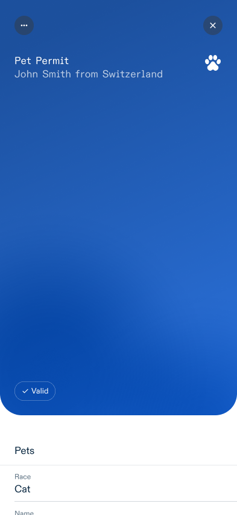
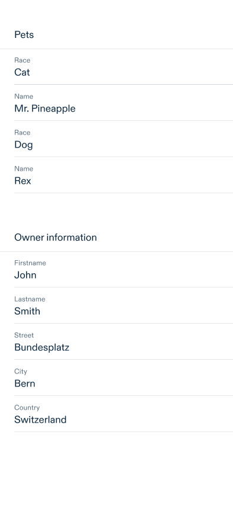
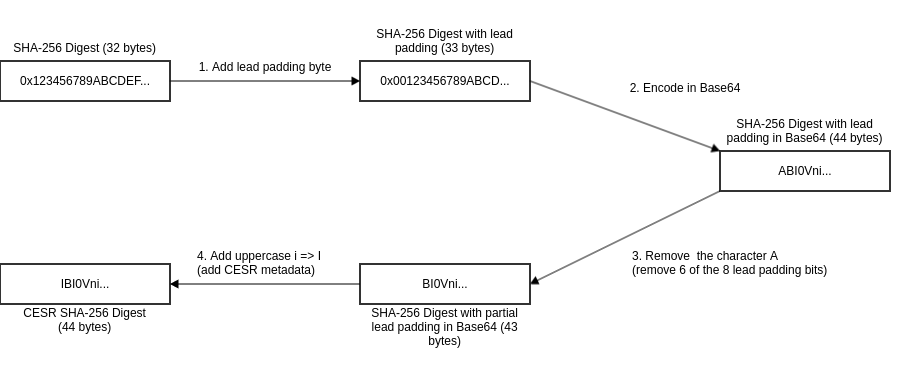

# Visualization of Verifiable Credential with OCA - Specification

Status: Draft<br/>
Version: 0.2<br/>

## Introduction

This document extends the [Overlays Capture Architecture (OCA)](https://oca.colossi.network/) by adding a technical specification for visualizing verifiable credentials (VCs) through a mobile wallet. The aim is to define a set of requirements and clarify the use and support of OCA functionalities that go beyond the core [OCA specifications 1.0.1](https://oca.colossi.network/specification/) by focusing on the context of VC visualization.

<a id="capture-base-extension"></a>

## OCA bundle as JSON file

OCA bundle **MAY** be represented by a file containing an JSON object.

The JSON object **MUST** contain the following properties:

- `capture_bases` Array containing one or more Capture Base objects.
    - A Capture Base is called the root Capture Base, if it isn't referenced by any other Capture Base.
    - There **MUST** only be one root Capture Base.
- `overlays` Array containing one or more Overlay objects.

**OCA bundle as a JSON file example**

```json
{
    "capture_bases":[
        {
            "type":"spec/capture_base/1.0",
            "digest":"IAKfY-vUaevuIqDQreQyd6YYpALJIH1IZMPjpX4tOOuQ",
            "attributes":{
                "firstname":"Text",
                "lastname":"Text",
                "pets":"Array[refs:IKLvtGx1NU0007DUTTmI_6Zw-hnGRFicZ5R4vAxg4j2j]"
            }
        },
        {
            "type":"spec/capture_base/1.0",
            "digest":"IKLvtGx1NU0007DUTTmI_6Zw-hnGRFicZ5R4vAxg4j2j",
            "attributes":{
                "race":"Text",
                "name":"Text"
            }
        }
    ],
    "overlays":[
        {
            "type":"spec/overlays/meta/1.0",
            "capture_base":"IAKfY-vUaevuIqDQreQyd6YYpALJIH1IZMPjpX4tOOuQ",
            "language":"en",
            "name":"Example VC"
        }
    ]
}
```

## Additional Overlays
The following Overlays are defined additionally to the ones defined in the core OCA specification to be able to visualization verifiable credentials.

### Data Source Mapping Overlay
The core OCA specification captures an abstracted data structure in their Capture Base. A client with an complete understanding of the semantic could then implicitely link the Capture Base to their data source.
Currently this is not the case with verifiable credentials and also why an additional overlay is necessary to link the Capture Base to the actual VC data source.

This specification adds an overlay which defines a mapping between the Capture Base attributes and their data sources with the following attributes:

- `format` String defining the format for which the data source mapping can be used to. Formats for verifiable credentials are defined in [OpenID4VCI credential format profiles](https://openid.net/specs/openid-4-verifiable-credential-issuance-1_0-ID1.html#name-credential-format-profiles).
- `attribute_sources` JSON object that contains a map of key-value pairs (String:String) which defines the Capture Base attributes and a [JSONPath (RFC9535)](https://www.rfc-editor.org/rfc/rfc9535.html) to the data source.

And in the context of OCA Bundle, it adds the following constraints:

- the Data Source Mapping Overlay **MUST** use the value `extend/overlays/data_source/1.0` in the `type` attribute.

**Example of the Data Source Mapping Overlay**

```json
{
    "type":"extend/overlays/data_source/1.0",
    "capture_base":"IMFQWZ_xszfSOugAuYHmlhmQm3EUgJ_uk0S9ExISjqbc",
    "format":"vc+sd-jwt",
    "attribute_sources":{
        "firstname":"$.firstname",
        "lastname":"$.lastname"
    }
}
```

#### JSONPath Consideration

JSONPath allows the use of Regular Expressions and the use of function extensions. Both introduce important security risks, which implementors should mitigate.
This specification only uses the following parts of JSONPath:

- Absolut [Child Segments](https://www.rfc-editor.org/rfc/rfc9535.html#name-child-segment) which starts with the [Root Identifier](https://www.rfc-editor.org/rfc/rfc9535.html#root-identifier)
- The [Name Selector](https://www.rfc-editor.org/rfc/rfc9535.html#name-name-selector), [Wildcard Selector](https://www.rfc-editor.org/rfc/rfc9535.html#name-wildcard-selector) and the [Index Selector](https://www.rfc-editor.org/rfc/rfc9535.html#name-index-selector)

#### SD-JWT VC Consideration

The Data Source Mapping Overlay **MUST** be applied to SD-JWT VCs after their claims are disclosed, and the claims **MUST** be seen as hierarchical siblings to their respective `_sd` claim.

### Aries Branding Overlay update proposal
The core OCA specification does not include a way to add visualization metadata. The [Hyperledger Aries project](https://github.com/hyperledger/aries-rfcs/blob/main/features/0755-oca-for-aries/README.md#aries-specific-branding-overlay) has addressed this gap by proposing a Branding Overlay which mimics the options of visualizing data element about the branding of a given verifiable credential.

This specification adds additional attributes to the Branding Overlay to further enhance the visualization of Verifiable Credentials:

- the Branding Overlay **MAY** use the `language` attribute from the core OCA specification.
- the Branding Overlay **MAY** use an additional `theme` attribute.
- the Branding Overlay **MAY** use the `primary_field` attribute which define a primary field with templating support (see [branding overlay templating](#branding-overlay-templating)).
- the Branding Overlay **MAY** use the `secondary_field` attribute which define a secondary field with templating support (see [branding overlay templating](#branding-overlay-templating)).

And in the context of OCA Bundle, it adds the following constraints:

- the Branding Overlay **MUST** use the value `aries/overlays/branding/1.1` in the `type` attribute.
- the Branding Overlay **MUST** only use the embedded form of media in form of data URLs.

**Example of the Branding Overlay**

```json
{
    "type":"aries/overlays/branding/1.1",
    "capture_base":"IMFQWZ_xszfSOugAuYHmlhmQm3EUgJ_uk0S9ExISjqbc",
    "language":"en",
    "theme":"light",
    "logo":"data:image/png;base64,iVBORw0KGgoAAAANSUhEUgAAAAUAAAAFCAYAAACNbyblAAAAHElEQVQI12P4//8/w38GIAXDIBKE0DHxgljNBAAO9TXL0Y4OHwAAAABJRU5ErkJggg==",
    "background_image":"data:image/png;base64,iVBORw0KGgoAAAANSUhEUgAAAAUAAAAFCAYAAACNbyblAAAAHElEQVQI12P4//8/w38GIAXDIBKE0DHxgljNBAAO9TXL0Y4OHwAAAABJRU5ErkJggg==",
    "background_image_slice":"",
    "primary_background_color":"#003366",
    "secondary_background_color":"#003366",
    "primary_field":"Fullname: {{firstname}} {{lastname}}",
    "secondary_field":""
}
```

> [!NOTE]
> It is up to the Wallet implementors to interpret the Branding Overlay attributes they need to implement their design und style guidelines.

<a id="branding-overlay-templating"></a>

#### Templating Support

`primary_field` and `secondary_field` support the following templating:

- Expression between double brackets `{{EXPRESSION}}` are interpreted as attribute from the Capture Base and **MUST** be replaced by the attribute's value.
- When an expression can not be mapped to an attribute, it **SHOULD** be ignored.
- Everything outside of double brackets has to be interpreted as a static string.

**Example of a templating value**

```
Input:
- firstname: John
- lastname: Smith

template:
- "Fullname: {{firstname}} {{lastname}}"

result:
- "Fullname: John Smith"
```


### Cluster Ordering Overlay
The Cluster Ordering Overlay adds the possibility to enable the grouping and ordering of attributes defined in the OCA Capture Base. It allows VC Issuers to group more relevant attributes first and order technical based information like identifiers at the end.

- The `type` attribute's value **MUST** be `extend/overlays/cluster_ordering/1.0`

In addition to the `capture_base`, `type` and `language` attributes (see Common attributes), the Cluster Ordering Overlay **MUST** include the following attribute:

- `cluster_order`
JSON object that contains a map of key-value pairs (String:Int) which defines the identifiers of the different clusters and their order.

- `attribute_cluster_order`
JSON object that contains JSON objects with a key labeled after a cluster identifier. Each cluster JSON object contains a map of key-value pairs (String:Int) which defines the order of the attributes within the cluster.

and `MAY` include

- `cluster_labels`
JSON object that contains a map of key-value pairs (String:String) which defines the language in which the attributes of the cluster identifiers are displayed. The label of a cluster without a defined cluster-identifier-label mapping is not visually rendered.

Attributes not declared in the Cluster Ordering Overlay **SHOULD** be visually displayed after the declared clusters and **MUST** not be hidden from the user. 

>[!NOTE]
> It is up to the Wallet implementers to define the order and cluster for non declared attributes.

**Cluster Odering Example**

Dataset
```json
{
    "id":"123456",
    "name":"Helvetia",
    "birthdate":"2000-01-01",
    "photo":"data:image/png;base64,..."
}
```

OCA bundle
```json
{
    "capture_bases":[
        {
            "type":"spec/capture_base/1.0",
            "digest":"IJJU-BJDRi-5T3oTTXhfa_-v5CCGWYG2x9oY_k8-k5Fu",
            "attributes":{
                "id":"Text",
                "name":"Text",
                "birthdate":"DateTime",
                "photo":"Text"
            }
        }
    ],
    "overlays":[
        {
            "capture_base":"IJJU-BJDRi-5T3oTTXhfa_-v5CCGWYG2x9oY_k8-k5Fu",
            "type":"extend/overlays/cluster_ordering/1.0",
            "language":"de",
            "cluster_order":{
                "main":1,
                "additional":2
            },
            "cluster_labels":{
                "main":"Inhalt",
                "additional":"Ergänzungen"
            },
            "attribute_cluster_order":{
                "main":{
                    "name":2,
                    "photo":1,
                    "birthdate":3
                },
                "additional":{
                    "id":1
                }
            }
        }
    ]
}
``` 

## Special type handling
In the core OCA specification, attributes in the Capture Base are defined through a data type. Those data types are not only used to understand the type of an attribute value but also to provide a specific way to interpret data in the Overlays.

Special types, such as data URLs, need to have a standardised representation so that they can be interpreted the same way by everyone.

### DateTime ISO8601
The DateTime type is represented with the following constraints:

- The DateTime attribute **MUST** be of type `DateTime` in the Capture Base.
- The DateTime **SHOULD** define the ISO8601 time format in the Format Overlay. If none is specified, the time format `YYYY-MM-DDTHH:mm:ssZ` **MUST** be assumed.
- The DateTime **MUST** define ISO8601 with the urn URI scheme in the Standard Overlay.

**Example OCA bundle with a DateTime attribute**

```json
{
    "capture_bases":[
        {
            "type":"spec/capture_base/1.0",
            "digest":"ICE4Oj4VNLZuYGv7Qm-3Z6F-ojQPMp_ke8LQdy38BdvH",
            "attributes":{
                "date":"DateTime"
            }
        }
    ],
    "overlays":[
        {
            "capture_base":"ICE4Oj4VNLZuYGv7Qm-3Z6F-ojQPMp_ke8LQdy38BdvH",
            "type":"spec/overlays/format/1.0",
            "attribute_formats":{
                "date":"YYYY-MM-DDTHH:mm:ssZ"
            }
        },
        {
            "capture_base":"ICE4Oj4VNLZuYGv7Qm-3Z6F-ojQPMp_ke8LQdy38BdvH",
            "type":"spec/overlays/standard/1.0",
            "attr_standards":{
                "date":"urn:iso:std:iso:8601"
            }
        }
    ]
}
```

### Data URLs
Data URL is a way to represent media like image in a compact form to be embedded into other formats. Data URLs are defined by the [RFC2397](https://datatracker.ietf.org/doc/html/rfc2397).

Data URLs are represented with the following constraints:

- The data URL attribute **MUST** be of type `Text` in the Capture Base
- The data URL image **MUST** define RFC2397 with the urn URI scheme in the Standard Overlay

**Example OCA bundle with an image Data URL**

```json
{
    "capture_bases":[
        {
            "type":"spec/capture_base/1.0",
            "digest":"IFM8RfatBApjAWtUuoPdHBw7u-poW49aGCMSgoK1pwu5",
            "attributes":{
                "picture":"Text"
            }
        }
    ],
    "overlays":[
        {
            "capture_base":"IFM8RfatBApjAWtUuoPdHBw7u-poW49aGCMSgoK1pwu5",
            "type":"spec/overlays/standard/1.0",
            "attr_standards":{
                "picture":"urn:ietf:rfc:2397"
            }
        }
    ]
}
```

## OCA reference in Verifiable Credentials
For the OCA to be usable, it needs to be resolvable by the Wallet and referenced inside the VC.

Additional VC formats **MAY** be specified and used as long as the Wallet is able to resolve the OCA bundle. 

### SD-JWT VC
When an Issuer desires to specify OCA rendering instructions for a Verifiable Credential in the `vc+sd-jwt` format, they **MUST** add a render property to the type metadata, that uses the data model described below. This specification extends the [SD-JWT VC Render Metadata](https://www.ietf.org/archive/id/draft-ietf-oauth-sd-jwt-vc-05.html#name-rendering-metadata) with a new "oca" method.

The `oca` rendering method is intended for use in applications that support OCA rendering. The object **MUST** contain the following properties:

- `uri` A URI which is either a URL that points to an OCA bundle file with an associated `application/json` media type or a Data URL.
- `uri#integrity` The value **MUST** be set in case the `uri` is a URL. If `uri` is a Data URL, the value **MAY** be set. The value **MUST** be an "integrity metadata" string as defined in Section 3 of [W3C.SRI](https://www.w3.org/TR/SRI/#framework). If the `uri` is a Data URL, the "integrity metadata" string **MUST** be about the whole Data URL. A Consumer of the respective documents **MUST** verify the integrity of the retrieved document as defined in Section 3.3.5 of [W3C.SRI](https://www.w3.org/TR/SRI/#does-response-match-metadatalist).


**Example SD-JWT VC Rendering Method**

```json
{
    "rendering":{
        "oca":{
            "uri":"https://example.com/oca/oca-bundle.json",
            "uri#integrity":"sha256-9cLlJNXN-TsMk-PmKjZ5t0WRL5ca_xGgX3c1VLmXfh-WRL5"
        }
    }
}
``` 

### W3C VCDM 2.0
In a similar way, if an Issuer desires to specify OCA rendering instructions for a W3C Verifiable Credential, they **MUST** add a `renderMethod` property that uses the data model described below.

- `renderMethod`
JSON array containing URIs to metadata that help the visualisation of the W3C VC
    - `type`
A string which represent the type of rendering. **MUST** be `OverlaysCaptureBundleV1`
    - `id`
A URL that dereferences to an OCA bundle file with an associated `application/json` media type or a Data URL.
    - `digestSRI`
 The value **MUST** be an "integrity metadata" string as defined in Section 3 of [W3C.SRI](https://www.w3.org/TR/SRI/#framework). A Consumer of the respective documents **MUST** verify the integrity of the retrieved document as defined in Section 3.3.5 of [W3C.SRI](https://www.w3.org/TR/SRI/#does-response-match-metadatalist).


**Example W3C VCDM 2.0 RenderMethod**

```json
{
    "renderMethod":[
        {
            "id":"https://example.com/oca/oca-bundle.json",
            "type":"OverlaysCaptureBundleV1",
            "digestSRI":"sha256-9cLlJNXN-TsMk-PmKjZ5t0WRL5ca_xGgX3c1VLmXfh-WRL5"
        }
    ]
}
```

## Limitations
- OCA bundle **MUST** be a single json file
- Capture Bases and Overlays **MUST** be canonicalized with [JCS (RFC8785)](https://datatracker.ietf.org/doc/html/rfc8785) before generating a digest.

## Implementation Guide

<a id="handling-nested-objects"></a>

### Handling nested objects

The following example presents how nested object **MUST** be presented in the core OCA specification.

The extension of the Capture Base definition in chapter [Capture Base Extension](#capture-base-extension) allows for multiple Capture Base in one file and gives the capability to define every aspect of a verifiable credential.

As per OCA core specification, Capture Base can be referenced by using the `refs:` prefix followed by the CESR digest of the additional Capture Base.

The following example includes a nested object `pets` which gives the possibility to define visual properties of array items.

Dataset
```json
{
    "firstname":"John",
    "lastname":"Smith",
    "address":{
        "street":"Bundesplatz",
        "city":"Bern",
        "country":"Switzerland"
    },
    "pets":[
        {
            "race":"Dog",
            "name":"Rex"
        },
        {
            "race":"Cat",
            "name":"Mr. Pineapple"
        }
    ]
}
```

OCA bundle
```json
{
    "capture_bases":[
        {
           "type":"spec/capture_base/1.0",
            "digest":"IDif6Jd863C_YYjp1cHFCTAUr1_TzZSS1l-pv21Q56qs",
            "attributes":{
                "firstname":"Text",
                "lastname":"Text",
                "address_street":"Text",
                "address_city":"Text",
                "address_country":"Text",
                "pets":"Array[refs:IKLvtGx1NU0007DUTTmI_6Zw-hnGRFicZ5R4vAxg4j2j]"
            }
        },
        {
           "type":"spec/capture_base/1.0",
            "digest":"IKLvtGx1NU0007DUTTmI_6Zw-hnGRFicZ5R4vAxg4j2j",
            "attributes":{
                "name":"Text",
                "race":"Text"
            }
        }
    ],
    "overlays":[
        {
            "type":"extend/overlays/data_source/1.0",
            "capture_base":"IDif6Jd863C_YYjp1cHFCTAUr1_TzZSS1l-pv21Q56qs",
            "format":"vc+sd-jwt",
            "attribute_sources":{
                "firstname":"$.firstname",
                "lastname":"$.lastname",
                "address_street":"$.address.street",
                "address_city":"$.address.city",
                "address_country":"$.address.country",
                "pets":"$.pets"
            }
        },
        {
            "type":"extend/overlays/data_source/1.0",
            "capture_base":"IKLvtGx1NU0007DUTTmI_6Zw-hnGRFicZ5R4vAxg4j2j",
            "format":"vc+sd-jwt",
            "attribute_sources":{
                "name":"$.pets[*].name",
                "race":"$.pets[*].race"
            }
        },
        {
            "type":"aries/overlays/branding/1.1",
            "capture_base":"IDif6Jd863C_YYjp1cHFCTAUr1_TzZSS1l-pv21Q56qs",
            "language":"en",
            "theme":"light",
            "logo":"data:image/jpeg;base64,iVBORw0KGgoAAAANSUhEUgAAABoAAAAaCAYAAACpSkzOAAAACXBIWXMAAAsTAAALEwEAmpwYAAAAAXNSR0IArs4c6QAAAARnQU1BAACxjwv8YQUAAAGbSURBVHgBvVaBUcMwDFQ4BjAbmA06QjYgGzQbkA1aJmg3yHWCwgSGCVImcJkg3UDYjVMUI6VxW/g7X+701kuWZTsAI0DEwo0GO9RuKMKpYGvdsH4uXALnqPE3DOFrhs8hFc5pizxyN2YCZyS9+5FYuWCfgYzZJYFUon2UuwMZ+xG7xO3gXKBQ95xwGyHIuxuvbhwY/oPo+WbSQAyKtDCGVtWM3aMifmXENcGnb3uqp6Q2NZHgEpnWDQl5rsJwxgS9NTBZ98ghEdgdcA6t3yOpJQtGSIUVekHN+DwJWsfSWSGLmsm2xWHti2iOEbQav6I3IYtPIqDdZwvDc3K0OY5W5EvQ2vUb2jJZaBLIogxL5pUcf9LC7gzZQPigJXFe4HmsyPw1sRvk9jKsjj4Fc5yOOfFTyDcLcEGfMR0VpACnlUvC4j+C9FjFulkURLuPhdvgIcuy08UbPxMabofBjRMHOsAfIS6db21fOgXXYe/K9kgNgxWFmr7A9dhMmoXD001h8OcvSPpLWkIKsLu3THC2yBxG7B48S5IoJb1vHubbPPxs2qsAAAAASUVORK5CYII=",
            "primary_background_color":"#2C75E3",
            "primary_field":"{{firstname}} {{lastname}} from {{address_country}}"
        },
        {
            "type":"spec/overlays/meta/1.0",
            "capture_base":"IDif6Jd863C_YYjp1cHFCTAUr1_TzZSS1l-pv21Q56qs",
            "language":"en",
            "name":"Pet Permit"
        },
        {
            "capture_base":"IDif6Jd863C_YYjp1cHFCTAUr1_TzZSS1l-pv21Q56qs",
            "type":"extend/overlays/cluster_ordering/1.0",
            "language":"en",
            "cluster_order":{
                "pets":1,
                "owner":2
            },
            "cluster_labels":{
                "pets":"Pets",
                "owner":"Owner information"
            },
            "attribute_cluster_order":{
                "pets":{
                    "pets":1
                },
                "owner":{
                    "firstname":1,
                    "lastname":2,
                    "address_street":3,
                    "address_city":4,
                    "address_country":5
                }
            }
        },
        {
            "capture_base":"IKLvtGx1NU0007DUTTmI_6Zw-hnGRFicZ5R4vAxg4j2j",
            "type":"spec/overlays/label/1.0",
            "language":"en",
            "attribute_labels":{
                "race":"Race",
                "name":"Name"
            }
        },
        {
            "capture_base":"IDif6Jd863C_YYjp1cHFCTAUr1_TzZSS1l-pv21Q56qs",
            "type":"spec/overlays/label/1.0",
            "language":"en",
            "attribute_labels":{
                "firstname":"Firstname",
                "lastname":"Lastname",
                "address_street":"Street",
                "address_city":"City",
                "address_country":"Country"
            }
        },
        {
            "capture_base":"IKLvtGx1NU0007DUTTmI_6Zw-hnGRFicZ5R4vAxg4j2j",
            "type":"extend/overlays/cluster_ordering/1.0",
            "language":"en",
            "cluster_order":{
                "default":1
            },
            "cluster_labels":{},
            "attribute_cluster_order":{
                "default":{
                    "race":1,
                    "name":2
                }
            }
        }
    ]
}
```

#### Rendering Algorithm and Example

This chapter defines a rendering algorithm and an example with the data from chapter [Handling nested objects](#handling-nested-objects).

The general rendering process follows this steps:

1. Parse the Capture Base(s) and detect references between them and verify to not create a reference loop.
2. Parse all Overlays.
3. Use the **Data Source Mapping Overlay** to map between the input data and the Capture Base attributes.
4. Render the visuals with the remaining Overlays.

The rendering process depends on which view is rendered. Here are two rendering example for a VC preview and detail view.

**VC Preview rendering**

1. Search for the **Branding Overlay** and the **Meta Overlay** in the root Capture Base
2. Get the raw attribute data with the query in the **Data Source Mapping Overlay**
3. Interpret the data types of the Capture Base attributes and search for additional context on how to visualize them in the **Standard Overlay**, **Format Overlay**, etc.
4. Interpret the data into a preview view like the following example:



<br/>

**VC Detail rendering**

1. Get the raw attribute data with the query in the **Data Source Mapping Overlay**
2. Search for the **Cluster Ordering Overlay** in the root Capture Base
3. Iterate over the Capture Base attributes in the **Cluster Ordering Overlay** and search for additional context on how to visualize them in the **Standard Overlay**, **Format Overlay**, etc.
    * If the attribute is **NOT** of type Reference, render them visually
    * If the attribute is of type Reference, start again from 1. with the referenced Capture Base
4. Interpret the data into a detail view like the following example:




<br/>

### CESR encoding
The OCA specification defines that the OCA file name and the digest inside the OCA bundle have to use the [CESR encoding](https://weboftrust.github.io/ietf-cesr/draft-ssmith-cesr.html).

CESR is an encoding format for text and binary data that has the unique property of text-binary concatenation composability (for context: A popular encoding format for binary is Base64).

For those interested, the composable concatenation is described in detail in the [CESR Specification](https://trustoverip.github.io/tswg-cesr-specification/#concatenation-composability-property). However, it is not necessary to understand how the encoding of digests works to proceed with this document.

CESR uses the Base64 transformation in it's process to encode binaries but the composability property only works when no Base64 padding is used (when you have padding in Base64 you can not add two binaries together!).

To avoid Base64 padding, the smallest common denominator between the number of bits in a byte and the information stored in a Base64 character (6 bits of information in a byte) has to be used.

The smallest common denominator of 8 and 6 is 24, so the smallest CESR unit is 24 bits. The essential information here is that the number of bits used for binary text encoding with CESR has to be divisible by 8 and 6.

Each CESR encoding also includes metadata over the content of the data. In the digest case, it will start with a letter which defines which digest algorithm was used.

### Generate CESR encoding flow with SHA-256
A SHA-256 digest has a size of 256 bits. It is divisible by 8 but not by 6. The next possible value would be 264 bits which are 33 bytes.

Hence, the CESR encoding will need 33 bytes to work which means that the SHA-256 hash needs a padding byte.

The CESR encoding flow works as described next and depicted in Fig. 1.:

1. Add a leading padding byte to the binary digest. (result = lead byte + binary digest)
2. Encode the result from step 1 in Base64
3. Remove the part of the Base64 encoded padding by removing character A (will remove 6 of the 8 lead padding bits)
4. Add the CESR metadata letter in front of the result of step 3 (uppercase i => I for SHA-256 digest)



A [CESR SHA-256 JavaScript implementation](./appendixes/cesr-sha256-encoder.md) can be found in the appendix.

### Creation example of an OCA Bundle
1. Prepare the capture_base and fill the digest with the diggest dummy defined by [CESR](https://weboftrust.github.io/ietf-cesr/draft-ssmith-cesr.html#section-4.2) (44 '#' for the SHA-256 digest).
    ```json
    {
        "type":"spec/capture_base/1.0",
        "digest":"############################################",
        "attributes":{
            "name":"Text"
        }
    }
    ``` 

2. Compute the CESR encoded SHA-256 digest with the code given above and put the value into the digest property. The output should match the following result.

    ```json
    {
        "type":"spec/capture_base/1.0",
        "digest":"IBYzBHEN4moeVO_aQtW_DbDoQd-30BgeJQMyfsRzoUFI",
        "attributes":{
            "name":"Text"
        }
    }
    ``` 

3. Add the Capture Base and Overlays to the JSON and fill the reference to the Capture Base in each Overlay.

    ```json 
    {
        "capture_bases":[
            {
                "type":"spec/capture_base/1.0",
                "digest":"IBYzBHEN4moeVO_aQtW_DbDoQd-30BgeJQMyfsRzoUFI",
                "attributes":{
                    "name":"Text"
                }
            }
        ],
        "overlays":[
            {
                "capture_base":"IBYzBHEN4moeVO_aQtW_DbDoQd-30BgeJQMyfsRzoUFI",
                "type":"spec/overlays/label/1.0",
                "language":"fr-CH",
                "attribute_labels":{
                    "name":"Nom"
                }
            }
        ]
    }

    ```
4. The core OCA specification computes a CESR encoded digest for each Overlay in the same way as in steps 1 and 2. This documentation skips the generation of the Overlay digests, as the additional digests add no value to a single file OCA bundle. 

After those steps the following content is generated:

```json
{
    "capture_bases":[
        {
            "type":"spec/capture_base/1.0",
            "digest":"IBYzBHEN4moeVO_aQtW_DbDoQd-30BgeJQMyfsRzoUFI",
            "attributes":{
                "name":"Text"
            }
        }
    ],
    "overlays":[
        {
            "capture_base":"IBYzBHEN4moeVO_aQtW_DbDoQd-30BgeJQMyfsRzoUFI",
            "type":"spec/overlays/label/1.0",
            "language":"fr-CH",
            "attribute_labels":{
                "name":"Nom"
            }
        }
    ]
}
```

## References

**Aries Branding Overlay**<br/>
https://github.com/hyperledger/aries-rfcs/blob/main/features/0755-oca-for-aries/README.md#aries-specific-branding-overlay

**CESR**<br/>
https://weboftrust.github.io/ietf-cesr/draft-ssmith-cesr.html

**ISO8601**<br/>
https://www.iso.org/iso-8601-date-and-time-format.html

**OpenID4VCI credential format profiles**<br/>
https://openid.net/specs/openid-4-verifiable-credential-issuance-1_0-ID1.html

**Overlays Capture Architecture**<br/>
https://oca.colossi.network/specification/

**RFC2397**<br/>
https://datatracker.ietf.org/doc/html/rfc2397

**RFC8785**<br/>
https://datatracker.ietf.org/doc/html/rfc8785

**RFC9535**<br/>
https://www.rfc-editor.org/rfc/rfc9535.html

**SD-JWT VC**<br/>
https://datatracker.ietf.org/doc/draft-ietf-oauth-sd-jwt-vc/

**W3C.SRI**<br/>
https://www.w3.org/TR/SRI/

**W3C VCDM 2.0**<br/>
https://www.w3.org/TR/vc-data-model-2.0/
